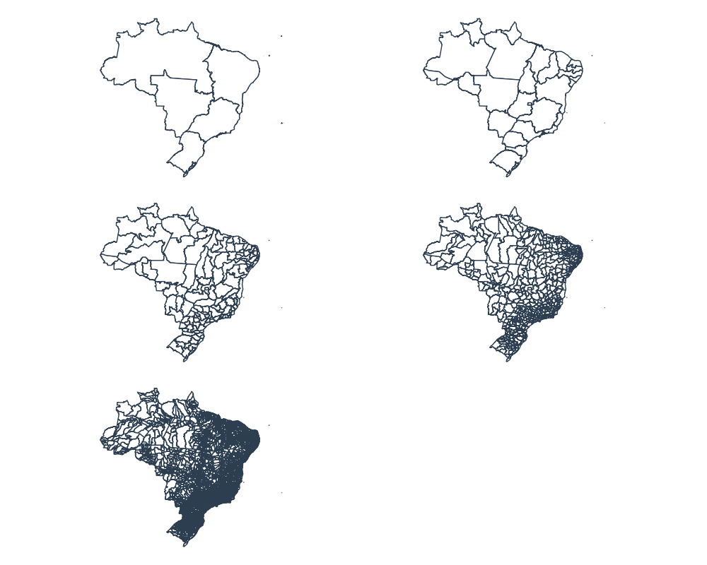

.. mapsbr documentation master file, created by
   sphinx-quickstart on Mon Dec 30 18:28:27 2019.
   You can adapt this file completely to your liking, but it should at least
   contain the root `toctree` directive.

.. raw:: html

   

      

MapsBR: Brazilian geospatial data in Python
===========================================

.. raw:: html

      

   

   

   

      

         

             

**mapsbr** is a Python package to help you get brazilian geospatial data
from official sources like IBGE or an ArcGIS server.

It requests GeoJSON from official webservices and turn them into ``shapely``
geometric objects, that are then passed into a geopandas structure, a GeoSeries
or a GeoDataFrame, which are the usual pandas structure but with more capabilities
concerning geospatial data.
   
.. raw:: html
         
             
            

                

                  <h3 class="panel-title">Contents</h3>
                

               

.. toctree::
   :maxdepth: 1 

   Installation <installation>
   Introduction <introduction>
   Gallery <auto_gallery/index>
   API Reference <api/modules>

.. raw:: html
   
               

            

         

      

         

|maps|

.. raw:: html

         

      

   

